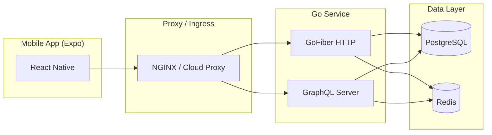

import { Tabs, Tab, Steps, Callout, Card, CardGroup } from 'nextra/components'

## Overview

Blindly is composed of three main layers:

- Backend service (Go) providing GraphQL and selected HTTP endpoints via Fiber.
- Frontend mobile application using React Native (Expo).
- PostgreSQL and Redis backing stores, with schema managed via Drizzle ORM.

A lightweight application proxy routes traffic to the appropriate protocol (GraphQL vs REST) behind a single origin.

<CardGroup cols={3}>
  <Card title="Backend" icon="server" href="#backend">
    GraphQL-first API with GoFiber, plus HTTP endpoints for specialized operations (health, file ops, webhooks).
  </Card>
  <Card title="Frontend" icon="smartphone" href="#frontend">
    React Native (Expo) application, OTA updates via Expo EAS, optimized for iOS & Android.
  </Card>
  <Card title="Database" icon="database" href="#database">
    PostgreSQL relational store with Drizzle-managed schema and migrations; Redis for caching & ephemeral data.
  </Card>
</CardGroup>

---

## High-level topology

- A single host (domain) terminates TLS and forwards requests to the Go backend.
- GraphQL is the primary interface; REST endpoints handle non-GraphQL operations: health checks, webhooks, file IO, and selected admin tasks.
- PostgreSQL stores core entities (users, matches, chats, posts, comments, reports, etc.).
- Redis is used for caching, sessions, rate limits, and lightweight queues.

---

## Backend

### Technology choices

- Go (modern toolchain) for performance and reliability.
- Fiber for fast HTTP routing and middleware ergonomics.
- GraphQL for strongly-typed APIs, introspection, and developer tooling.
- REST for selected endpoints better suited to plain HTTP (e.g., health, webhooks).

### API surface

<Tabs>
  <Tab title="GraphQL">
    - Typed schema driving the majority of product features: onboarding, matching, chat, social posts, verification state, profiles.
    - Benefits:
      - Single, composable query surface
      - Client-side flexibility in data selection
      - Introspection for tooling, auto docs, and mocks
  </Tab>
  <Tab title="HTTP">
    Common REST endpoints include:
    - `GET /health` — liveness & readiness checks (used by Docker/K8s)
    - `POST /webhooks/...` — service integrations (e.g. payments, storage events, external AI callbacks)
    - `GET /files/:id` — signed URLs or proxied secure file access
    - `POST /upload` — controlled file upload flows
  </Tab>
</Tabs>

### Request flow

<Steps>
  <li>
    Client sends request (GraphQL mutation/query or REST endpoint).
  </li>
  <li>
    Proxy (e.g., NGINX or Kubernetes Ingress) forwards to the Go backend.
  </li>
  <li>
    Backend authenticates the request (JWT or session token via Redis).
  </li>
  <li>
    Business logic executes, often combining cached reads (Redis) with authoritative writes (Postgres).
  </li>
  <li>
    Response is returned with precise shape (GraphQL) or resource representation (REST).
  </li>
</Steps>

### Responsibilities

- Identity & authentication
- Profile and content management (posts, comments)
- Matching engine orchestration (scoring, reveal flow)
- Chat storage and delivery metadata
- Reporting, moderation, verification workflow
- Observability (metrics, logs, tracing)

---

## Frontend (Expo)

### Technology choices

- React Native via Expo for cross-platform speed and a consistent deployment story.
- EAS (Expo Application Services) for build pipelines and over-the-air (OTA) updates.
- The app consumes GraphQL primarily; HTTP endpoints are used for specific flows (uploads, health checks, webhooks when applicable).

### Runtime behavior

- On app boot, the client fetches configuration and verifies token/session.
- GraphQL queries and mutations are batched when possible.
- OTA updates can be received without reinstalling from app stores, improving release velocity.

<Callout type="success" emoji="📱">
  Recommended: use Expo EAS and scan the latest build QR to install and test on iOS/Android.
</Callout>

---

## Database

### PostgreSQL schema

Core tables (managed by Drizzle):

- `users` — profile, identity, traits, preferences, timestamps
- `matches` — user-to-user matches with score, unlock state, rating
- `chats` — match-linked chat threads and messages
- `posts`, `comments` — social discovery layer
- `user_files` — references to user-uploaded assets (S3/secure storage pathing)
- `user_profile_activities` — pokes, views, superlikes
- `swipes` — explicit like/dislike/superlike actions
- `reports` — abuse reports with media and status
- `aichat_chats` — AI assistant conversation log
- `user_verifications` — identity verification records

### Redis usage

- Session store and short-lived tokens
- Caching for hot queries
- Rate limiting and ephemeral counters
- Background task coordination (lightweight queuing when applicable)

---

## Proxy

The proxy (e.g., NGINX or a managed edge) handles:

- TLS termination
- Path-based routing between GraphQL and REST handlers
- Request buffering limits, timeouts, and body size constraints
- Static assets (optional), though mobile app assets are primarily distributed via Expo

If deploying on Kubernetes, this is typically defined by an Ingress with annotations. See `deployment.yaml` for a reference setup (service on port 80 → backend 9000).

---

## Observability

- Health checks: `/health` for liveness/readiness.
- Logging: structured logs with request IDs and user IDs where applicable.
- Metrics: request latency, error rates, cache hit ratios, DB query timing.
- Tracing: span-based instrumentation around critical paths.

---

## Environment configuration

The backend requires:

- `DATABASE_URL` — connection string to Postgres
- `REDIS_URL` — connection string to Redis
- Additional runtime secrets loaded via `.env` or your orchestrator’s secret management

On Docker Compose:
- DB migrations run automatically via Drizzle.
- Backend service waits on healthy Postgres/Redis and successful migration.

On Kubernetes:
- Supply secrets via `Secret` and env mounts.
- Ensure readiness probes and resource limits are configured.

---

## Data flows

<Tabs>
  <Tab title="Matching & Reveal">
    1. Users express interest via actions (like/superlike/dislike) → `swipes`.
    2. Potential matches are scored using traits, conversation quality signals, and heuristics → `matches.score`.
    3. Chat opens on mutual interest → `chats`.
    4. After meaningful conversation, users can request reveal → `matches.is_unlocked`.
    5. Post-reveal rating updates the recommendation engine → `matches.post_unlock_rating`.
  </Tab>
  <Tab title="Social Discovery">
    1. Users create short posts → `posts` with optional media.
    2. Other users comment or poke → `comments`, `user_profile_activities`.
    3. Lightweight anonymity by default; identity is controlled.
  </Tab>
  <Tab title="Safety & Moderation">
    - Users can report content/users → `reports`.
    - Identity verification → `user_verifications`.
    - Abuse detection signals inform throttling and visibility.
  </Tab>
</Tabs>

---

## Summary

- GraphQL-first backend with GoFiber supporting both GraphQL and REST endpoints.
- Expo-based React Native frontend optimized for fast iteration and OTA updates.
- Postgres for persistent relational data; Redis for cache/ephemeral state.
- Flexible deployment through Docker Compose or Kubernetes + Ingress.
